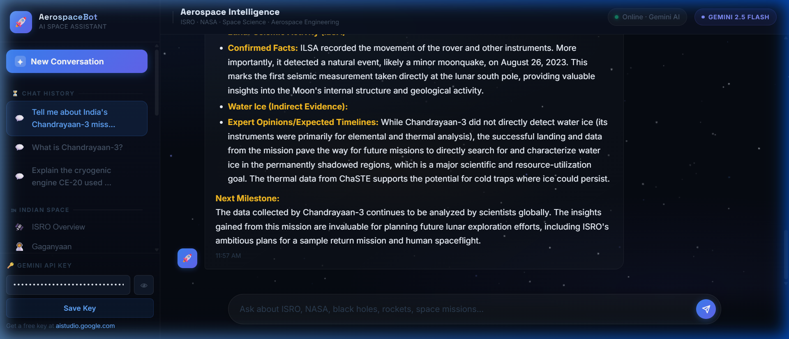

# 🚀 AerospaceBot — Domain-Specialized Space & Astronomy AI Assistant

[](https://github.com/Manvithagopireddy/AerospaceBot/actions/workflows/ci.yml)
[](https://nodejs.org/)
[](https://expressjs.com/)
[](https://aistudio.google.com/)
[](https://www.sqlite.org/)
[](https://developer.mozilla.org/en-US/docs/Web/JavaScript)
[](LICENSE)

> A full-stack, domain-restricted AI intelligence system built to deliver deep, formatted technical analyses on **ISRO**, **NASA**, rocket propulsion, satellite systems, astrophysics, and space exploration. Powered by Google Gemini 2.5 Flash with resilient multi-tier model fallbacks and persistent SQLite conversation storage.

---

## 📸 Live Interface Preview



---

## 🎯 Recruiter & Technical Overview

AerospaceBot is designed to solve the common pitfalls of generic conversational LLMs: **hallucination of mission parameters**, **off-topic conversational drift**, and **lack of structured engineering outputs**.

### Key Architectural Highlights:
- **Strict Domain Guardrails**: Custom system prompt architecture that programmatically constrains the LLM to aerospace, astronomy, and space tech, strictly rejecting off-topic prompts.
- **Structured Aerospace Schemas**: Automatically standardizes mission queries into formal engineering cards: *Launch Vehicle, Destination, Payload Instrumentation, Operational Status, and Next Milestones*.
- **High-Resilience LLM Cascade**: Implements an automatic failover mechanism (`gemini-2.5-flash` $\rightarrow$ `gemini-2.5-flash-lite` $\rightarrow$ `gemini-1.5-flash`) ensuring zero downtime during API deprecations or rate-limit surges.
- **Relational History Persistence**: Complete session and message threads persisted in SQLite with cascading deletes, thread switching, and rehydration.
- **Zero-Dependency High-Performance Frontend**: 60 FPS interactive HTML5 Canvas starfield simulation with meteors, glassmorphism design system, and custom Markdown-to-HTML parser without framework overhead.

---

## 🏗️ System Architecture

```text
┌─────────────────────────────────────────────────────────────┐
│                 Client Browser (HTML5/CSS3/ES6)             │
│   • HTML5 Canvas Particle Engine (Starfield + Meteors)      │
│   • Custom Markdown & Table Parser                          │
│   • Dual API Key Storage (Local + Server-Side)              │
│   • Real-Time Session Switcher & CRUD UI                    │
└──────────────────────────────┬──────────────────────────────┘
                               │ HTTP / JSON REST APIs
                               ▼
┌─────────────────────────────────────────────────────────────┐
│                 Node.js / Express.js Backend                │
│                                                             │
│   ┌─────────────────────┐       ┌───────────────────────┐   │
│   │   /api/chat Route   │       │  /api/sessions Routes │   │
│   └──────────┬──────────┘       └───────────┬───────────┘   │
└──────────────┼──────────────────────────────┼───────────────┘
               │                              │
       Multi-Tier Fallback                    ▼
               │                    ┌──────────────────┐
               ▼                    │  SQLite Database │
 ┌───────────────────────────┐      │  • sessions      │
 │  Google Generative AI     │      │  • messages      │
 │  1. gemini-2.5-flash      │      │    (Foreign Key, │
 │  2. gemini-2.5-flash-lite │      │     ON DELETE    │
 │  3. gemini-1.5-flash      │      │     CASCADE)     │
 └───────────────────────────┘      └──────────────────┘
```

---

## 🛠️ Tech Stack & Technologies

| Layer | Technologies Used | Key Rationale |
| :--- | :--- | :--- |
| **Frontend** | Vanilla HTML5, CSS3, JavaScript (ES6+) | Blazing fast load times (<100ms), zero dependency vulnerabilities, full DOM control. |
| **Graphics** | HTML5 2D Canvas API | Custom procedural particle system rendering twinkling stars, color variations, and shooting stars. |
| **Backend** | Node.js, Express.js | Lightweight asynchronous event loop suited for I/O-bound LLM API orchestration. |
| **Database** | SQLite3 (`sqlite3` driver) | Serverless, relational, ACID-compliant local database storing conversation history. |
| **AI Engine** | Google Gemini REST API | `gemini-2.5-flash` for high reasoning velocity and low-latency token generation. |
| **Environment** | `dotenv`, `cors`, `uuid` | Secure credential handling and UUID v4 session indexing. |

---

## 🚀 Getting Started

### Prerequisites
- **Node.js**: v18.0.0 or higher
- **npm**: v9.0.0 or higher
- **Gemini API Key**: Free key from [Google AI Studio](https://aistudio.google.com/)

### Installation & Run

1. **Clone the repository:**
   ```bash
   git clone https://github.com/Manvithagopireddy/AerospaceBot.git
   cd AerospaceBot
   ```

2. **Install dependencies:**
   ```bash
   npm install
   ```

3. **Configure Environment Variables:**
   Create a `.env` file in the root directory:
   ```env
   PORT=3000
   GEMINI_API_KEY=your_gemini_api_key_here
   ```
   *(Note: You can also enter or update your API key directly via the UI sidebar settings).*

4. **Launch the Application:**
   ```bash
   npm run dev
   ```

5. **Open in Browser:**
   Navigate to [http://localhost:3000](http://localhost:3000)

### 🧪 Automated Testing & Linting
Run the native test suite and syntax verification:
```bash
# Execute unit & integration test suite (8 tests)
npm test

# Verify JavaScript syntax across server and client
npm run lint
```

### 🐳 Docker Containerization
Build and run the containerized application locally:
```bash
# Build the Docker image
docker build -t aerospacebot .

# Run container with API key
docker run -p 3000:3000 -e GEMINI_API_KEY=your_gemini_api_key_here aerospacebot
```

---

## 📡 REST API Documentation

### 1. `POST /api/chat`
Sends conversation history to the Gemini AI pipeline with prompt guardrails and logs the conversation to SQLite.

- **Request Body:**
  ```json
  {
    "messages": [
      { "role": "user", "content": "What is Chandrayaan-3?" }
    ],
    "apiKey": "optional_client_key",
    "sessionId": "optional_session_uuid"
  }
  ```
- **Response:**
  ```json
  {
    "response": "**Mission:** Chandrayaan-3\n**Organization:** ISRO...",
    "model": "gemini-2.5-flash",
    "sessionId": "8d54aadf-6faa-480a-a0da-f3e06e01c1ab"
  }
  ```

### 2. `GET /api/sessions`
Retrieves all historical chat sessions ordered chronologically.

### 3. `GET /api/sessions/:id`
Retrieves all messages for a specific conversation session.

### 4. `DELETE /api/sessions/:id`
Deletes a conversation session and cascades deletion of all associated messages.

---

## 📁 Repository Structure

```text
AerospaceBot/
├── assets/
│   └── preview.png             # UI interface preview screenshot
├── server/
│   ├── db.js                   # SQLite database initialization & query helpers
│   └── server.js               # Express server, REST endpoints & Gemini prompt cascade
├── scripts/
│   └── chat.js                 # Frontend application state, starfield canvas, markdown renderer
├── styles/
│   └── theme.css               # Design system, glassmorphic tokens & responsive layout
├── .env.example                # Example environment variables template
├── database.sqlite             # SQLite database file (ignored in git)
├── index.html                  # Core application entrypoint
├── package.json                # Project dependencies and startup scripts
└── README.md                   # Comprehensive technical documentation
```

---

## 📄 License
This project is open-source and available under the [MIT License](LICENSE).

---

## 👤 Author
**Manvitha Gopireddy**
- GitHub: [@Manvithagopireddy](https://github.com/Manvithagopireddy)
- Repository: [Manvithagopireddy/AerospaceBot](https://github.com/Manvithagopireddy/AerospaceBot)
